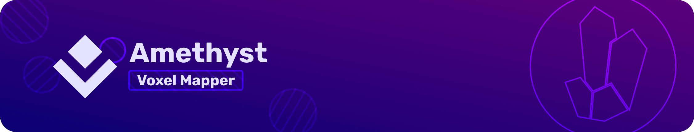

The Voxel Mapper is a set of Amethyst-compatible systems for creating beautiful
voxel worlds.


To build and run the example map:

```
GRAPHICS_BACKEND=metal
cargo run --bin editor --release --features amethyst/$GRAPHICS_BACKEND,amethyst/no-slow-safety-checks -- assets/maps/example_map.ron
```

When you exit the app, a binary file "saved_voxels.bin" will contain the map you just created.
You can load it back into the editor by setting `voxels_file_path: Some("saved_voxels.bin")` in "assets/maps/example_map.ron."

Control bindings can be found in "assets/config/map_editor_bindings.ron".

## Development

It's early days for this project. These features are currently supported:

- (de)serializable, chunked voxel map
- dynamic, smooth chunk meshing using Surface Nets
- multiple materials
- physically-based, triplanar material rendering, courtesy of Amethyst
- a voxel paintbrush
- a camera controller that resolves collisions with the voxels

Planned features:

- texture splatting
- texture detiling
- more materials
- dynamic voxel types (e.g. water)
- beautiful example maps
- level of detail
- procedural generation
